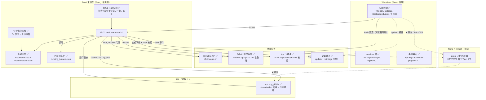
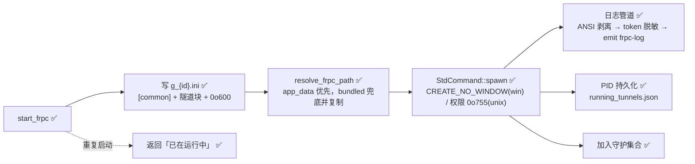

# ChmlFrpLauncher 架构设计

> 最后更新：2026-08-11
> 文档索引：`docs/README.md`。变更流程见 grill 产出的开发 plan（第 ② 步）。
> 📐 文档约束：mermaid 是完整设计，节点用状态标记说明实现状态。章节标题不写状态标记。文本陈述当前状态，不写 changelog 式措辞。存储/队列只记接口签名和装配关系，不展开设计细节。

- [一、系统全貌](#一系统全貌)
- [二、Rust 后端](#二rust-后端)
  - [2.1 命令模块](#21-命令模块)
  - [2.2 全局状态](#22-全局状态)
  - [2.3 应用生命周期（setup）](#23-应用生命周期setup)
  - [2.4 frpc 进程模型](#24-frpc-进程模型)
  - [2.5 进程守护](#25-进程守护)
- [三、前端架构](#三前端架构)
  - [3.1 App 装配](#31-app-装配)
  - [3.2 页面](#32-页面)
  - [3.3 services 层](#33-services-层)
  - [3.4 顶层 hooks](#34-顶层-hooks)
- [四、外部契约](#四外部契约)
  - [4.1 ChmlFrp API](#41-chmlfrp-api)
  - [4.2 OAuth 设备码登录](#42-oauth-设备码登录)
  - [4.3 frpc 下载源](#43-frpc-下载源)
  - [4.4 深链接协议](#44-深链接协议)
  - [4.5 更新端点](#45-更新端点)
- [五、事件通道](#五事件通道)
- [六、存储与文件](#六存储与文件)
  - [6.1 Rust 侧文件](#61-rust-侧文件)
  - [6.2 前端 localStorage](#62-前端-localstorage)
- [七、可观测性](#七可观测性)
- [八、待商榷 / 意向](#八待商榷--意向)

**状态标记**：
| 标记 | 含义 |
|------|------|
| ✅ | 已实现 |
| ❌ | 意向设计，待实现 |
| 🔄 | 存在但待变更（当前实现将被替换） |
| ⚠️ | 代码存在但条件不具备（如等待外部） |

---

## 一、系统全貌



### 进程拓扑

单实例桌面应用。Tauri 主进程（Rust）持有两个全局状态对象，通过 45 个 command 提供系统能力；WebView 内运行 React 前端（`withGlobalTauri: true`，全局 `window.__TAURI__` 可用）。每个运行中的隧道对应一个 frpc 子进程，主进程通过管道读取其 stdout/stderr 并转推为 `frpc-log` 事件。

- **桌面形态（当前）**：Tauri 2，支持 Windows / macOS / Linux（CI 三平台构建，`capabilities/desktop.json` 声明 `platforms: ["macOS", "windows", "linux"]`）。
- **fnOS 形态（意向 ❌）**：同一前端 + axum 守护进程，Tauri IPC 替换为 HTTP/WS，打包为 fnOS `.fpk`（详见 [八、待商榷 / 意向](#八待商榷--意向)）。

### 平台分支

| 能力 | Windows | macOS | Linux |
|------|---------|-------|-------|
| 隐藏标题栏 / 无边框 | ✅ `set_decorations(false)` + 自绘标题栏 | ✅ 无标题栏 + 红绿灯 | 原生标题栏 |
| 子进程无窗口 | ✅ `creation_flags(0x08000000)` | — | — |
| 杀进程 | `taskkill` | `libc::kill(SIGTERM/SIGKILL)` | `libc::kill` |
| 端口检测 | `netstat` | `sh` + `lsof` | `sh` + `ss/lsof` |
| 配置文件权限 | — | `0o600` | `0o600` |

---

## 二、Rust 后端

### 2.1 命令模块

15 个模块，按职责分 8 组（`src-tauri/src/commands/`）：

| 组 | 模块 | 命令 | 职责 |
|----|------|------|------|
| 进程管理 | `process` | `start_frpc` / `stop_frpc` / `is_frpc_running` / `get_running_tunnels` / `fix_frpc_ini_tls` / `resolve_domain_to_ip` | 官方隧道 frpc 生命周期、ini 生成与修复、DNS 解析 |
| 进程守护 | `process_guard` | `set/get_process_guard_enabled` / `add_guarded_process` / `add_guarded_custom_tunnel` / `remove_guarded_process` / `check_log_and_stop_guard` | 3s 轮询守护、错误日志模式停止 |
| 进程持久化 | `process_persistence` | `get_persisted_running_tunnels` / `stop_orphan_process` / `is_tunnel_process_alive` | PID 落盘、重启恢复、孤儿进程回收 |
| 自定义隧道 | `custom_tunnel` | `save/get/update/delete_custom_tunnel` / `get_custom_tunnel_config` / `start/stop_custom_tunnel` / `is_custom_tunnel_running` | 用户自写 ini 的解析、拆分、多隧道管理与启停 |
| 下载 | `download` | `check_frpc_exists` / `get_frpc_directory` / `get_download_url` / `download_frpc` | frpc 二进制流式下载、sha256 校验、断点续传 |
| HTTP | `http` | `http_request` / `http_request_raw` | ChmlFrp API 代理（绕 CORS）、原生响应透传 |
| 网络探测 | `ping` / `ports` | `ping_host` / `get_ports` / `check_local_port` | 节点延迟、端口占用检测（调系统命令） |
| 系统集成 | `autostart` / `background` / `tray` / `lib.rs` | `set/get_autostart` / `set/get_tunnel_auto_start` / `copy_background_*` / `import_background_image_folder` / `get_background_video_path` / `hide_window` / `show_window` / `quit_app` / `read_image_folder` | 开机自启、背景资源管理、窗口控制 |

### 2.2 全局状态

```rust
// models.rs — 仅接口签名
struct FrpcProcesses { processes: Mutex<HashMap<i32, Child>> }        // tunnel_id → 子进程句柄
struct ProcessGuardState {
    enabled: Arc<AtomicBool>,
    guarded_processes: Arc<Mutex<HashMap<i32, ProcessGuardInfo>>>,   // 受守护集合
    manually_stopped: Arc<Mutex<HashSet<i32>>>,                      // 手动停止白名单
}
enum TunnelType { Api { config: TunnelConfig }, Custom { original_id: String } }
```

两个状态对象在 `run()` 中 `manage()` 注册，command 通过 `State<'_, T>` 注入。**注意**：`FrpcProcesses` 与 `ProcessGuardState` 的 MutexGuard 生命周期规则（先 drop 再调 `stop_orphan_process`）是既有约束，改动时需保持。

### 2.3 应用生命周期（setup）

| 步骤 | 行为 |
|------|------|
| 插件装配 | single-instance（重复启动拉起主窗）、updater、dialog、fs、autostart、opener、deep-link |
| 系统托盘 | `TrayIconBuilder`，菜单「显示窗口 / 退出」；左键单击 toggle 窗口显隐（50ms 延时防 Windows 竞态） |
| 窗口行为 | 关闭请求拦截 → `prevent_close` + emit `window-close-requested`（前端弹确认） |
| 深链接 | listen `deep-link://new-url` → 显示 + 聚焦主窗 |
| 守护启动 | `start_guard_monitor` 后台线程（3s 间隔轮询） |
| 进程恢复 | `recover_running_tunnels` 找回上次运行的隧道（PID 存活检测） |
| 清理 | 删除 app_data_dir 下残留 `g_*.ini`（旧版官方隧道配置） |
| 窗口定制 | Windows 去装饰；macOS 空标题 |

### 2.4 frpc 进程模型



- **配置生成**：`generate_frpc_config` 输出 `[common]`（server_addr/port、tls_enable、tcp_mux、pool_count、kcp 协议、user/token）+ 隧道块（按类型输出 remote_port 或 custom_domains）。
- **日志管道**：每个子进程两个命名线程（`frpc-stdout-{id}` / `frpc-stderr-{id}`），逐行处理：`strip_ansi_escapes` → `sanitize_log`（用户 token / 节点 token 全面脱敏，含分片替换）→ 本地时间戳 → 每行过 `check_log_and_stop_guard` → emit `frpc-log`。
- **停止**：优先进程表 `kill + wait`；进程表无记录时走 `stop_orphan_process`（taskkill / SIGTERM→SIGKILL）。
- **孤儿恢复**：启动时读 `running_tunnels.json`，按 PID 存活状态剔除死进程。

### 2.5 进程守护

- 监控线程每 3s 遍历 `guarded_processes`，跳过 `manually_stopped` 白名单，`try_wait` 判定离线 → emit 警告 → 1s 后重启（官方隧道走 `start_frpc`，自定义隧道走 `start_custom_tunnel`）。
- **智能停止**：日志命中 `STOP_GUARD_PATTERNS`（token 不匹配、authorization failed、429、超出隧道上限、免费会员限制等 11 条）即从守护集合移除，避免无限重启循环（`process_guard.rs` `should_stop_guard_by_log`）。

---

## 三、前端架构

### 3.1 App 装配

`App.tsx` 顶层结构：`BackgroundLayer`（背景层）→ 标题栏（`TitleBar` / Windows 无边框时 `WindowControls`）→ `Sidebar`（classic / floating / floating_fixed 三种模式）→ 内容区（按 `activeTab` 切换 4 页面）。顶层挂载 10 个 hooks + 3 个对话框（AntivirusWarning / CloseConfirm / Update）。

用户状态：`StoredUser`（含 OAuth access/refresh token 与旧 usertoken 双轨）保存在 state，持久化于 localStorage `chmlfrp_user`。

### 3.2 页面

| 页面 | 职责 |
|------|------|
| Home | 用户信息卡、今日流量（recharts）、签到、交流群、FAQ、反馈入口 |
| TunnelList | 隧道卡片列表、创建/编辑/删除隧道、节点选择（预加载）、自定义隧道块、隧道启停（进度条）、右键菜单 |
| Settings | 外观（主题/背景/毛玻璃）、网络（代理/TLS/KCP/多路复用）、系统（自启动/守护/关闭行为）、更新 |
| Logs | 隧道日志查看（logStore 订阅，上限 5000 条） |

### 3.3 services 层

| 服务 | 关键接口 | 依赖 |
|------|----------|------|
| `api` | `login` / `fetchTunnels` / `fetchNodes` / `createTunnel` / `updateTunnel` / `deleteTunnel` / `offlineTunnel` / `fetchUserInfo` / `fetchSignInInfo` / `fetchFlowLast7Days` / `getNodeUdpSupport` / `fetchNodeInfo` / OAuth 设备码三件套 / `getStoredUser` | ✅ Tauri invoke `http_request`（绕过代理时）\| 浏览器降级 fetch |
| `frpcManager` | `startTunnel` / `stopTunnel` / `isTunnelRunning` / `getRunningTunnels` / `getPersistedRunningTunnels` / `stopOrphanProcess` / `isTunnelProcessAlive` / `fixFrpcIniTls` / `resolveDomainToIp` / `listenToLogs` | invoke + listen |
| `frpcDownloader` | 下载进度监听、`download_frpc` | invoke + listen |
| `customTunnelService` | 自定义隧道 CRUD / 启停 | invoke |
| `logStore` | 内存日志环（5000 条）+ 订阅 | `frpcManager.listenToLogs` |
| `updateService` | `checkUpdate` / `installUpdate` / `getCurrentVersion` | updater 插件 |
| `autostartService` / `autoStartTunnelsService` | 自启动开关读写 | invoke |
| `ports` / `deepLinkService` / `logout` | 端口检测 / 深链接事件 / 登出清理 | invoke / listen |

### 3.4 顶层 hooks

| hook | 职责 |
|------|------|
| `useAppInitialization` | 启动 logStore 监听 + 守护开关初始化 + 禁用右键菜单 |
| `useAppTheme` | next-themes 明暗主题 |
| `useBackground` | 背景图/视频/轮播/毛玻璃状态 |
| `useAutoStartTunnels` | 登录后按配置自动拉起隧道 |
| `useDeepLink` | 深链接事件 → 自动登录/启动隧道 |
| `useTunnelNotifications` | 隧道状态变更 toast |
| `useWindowEvents` | 关闭确认流程 |
| `useTitleBar` | 标题栏显隐（平台判断） |
| `useUpdateCheck` | 启动时检查更新 |
| `useFrpcDownload` | frpc 缺失检测 + 下载引导 + 杀软警告 |

---

## 四、外部契约

### 4.1 ChmlFrp API

Base：`https://cf-v2.uapis.cn`。统一响应 `{code, msg, data}`，`code === 200` 为成功。鉴权头 `authorization: Bearer <accessToken>`（OAuth 新体系）或旧 `usertoken`（legacy 双轨兼容）。

| 端点 | 方法 | 用途 |
|------|------|------|
| `/login` | POST | 账密登录（旧） |
| `/tunnel` | GET | 隧道列表 |
| `/flow_last_7_days` | GET | 近 7 日流量 |
| `/userinfo` | GET | 用户信息 |
| `/qiandao_info` | GET | 签到信息 |
| `/offline_tunnel` | POST | 下线隧道 |
| `/delete_tunnel?tunnelid=` | GET | 删除隧道 |
| `/node` | GET | 节点列表（UDP 支持缓存 5min） |
| `/nodeinfo?node=` | GET | 节点详情 |
| `/create_tunnel` | POST | 创建隧道 |
| `/update_tunnel` | POST | 更新隧道 |

### 4.2 OAuth 设备码登录

账户服务 `https://account-api.qzhua.net`，client_id `019d4334b34972ca9fd41513e5703dfd`（无 client_secret，public client）：

1. `POST /oauth2/device_authorization` → `device_code` + `user_code` + 验证 URI
2. 用户浏览器完成授权
3. `POST /oauth2/token`（`grant_type=urn:ietf:params:oauth:grant-type:device_code`）→ access/refresh token
4. 续期走 `grant_type=refresh_token`，过期前 60s 自动刷新；刷新失败清除登录态

### 4.3 frpc 下载源

`https://cf-v1.uapis.cn/download/frpc/frpc_info.json` → `{downloads: [{os, arch, platform, link, hash(sha256), size}]}`。按平台映射表（win/linux/darwin × x86_64/arm/aarch64/mips/riscv 等）匹配；流式下载 + 1MB 分块 + Range 续传（最多 5 次重试）+ sha256 校验 + 可执行权限 0o755（Unix）。环境变量 `BYPASS_PROXY`（默认 true）控制是否走系统代理。

### 4.4 深链接协议

`chmlfrp://usertoken/start/{tunnel_id}` 或 `chmlfrp://start/{tunnel_id}`（deep-link 插件注册 scheme）。

### 4.5 更新端点

updater 插件（minisign 签名，公钥内置于 tauri.conf.json）：`https://cf-v2.uapis.cn/launcher/update` + GitHub Releases `latest.json`。手动确认后下载安装，重启生效。

---

## 五、事件通道

| 事件 | 方向 | 载荷 | 触发点 |
|------|------|------|--------|
| `frpc-log` | Rust → 前端 | `{tunnel_id, message, timestamp}` | 日志管道逐行 emit |
| `download-progress` | Rust → 前端 | `{downloaded, total, percentage}` | frpc 下载（≥100KB 节流） |
| `tunnel-auto-restarted` | Rust → 前端 | `{tunnel_id, timestamp}` | 守护自动重启成功 |
| `window-close-requested` | Rust → 前端 | `()` | 窗口关闭拦截（前端弹确认） |
| `deep-link://new-url` | 插件 → Rust → 前端 | URL | 浏览器唤起（lib.rs 监听后聚焦窗口） |
| `minimizeToTray` / `closeApp` | 前端 window CustomEvent | `()` | 关闭确认对话框 → 托盘/退出 |
| `sidebarModeChanged` | 前端 window CustomEvent | `()` | 设置页改侧边栏模式 → App 同步 |

---

## 六、存储与文件

### 6.1 Rust 侧文件

目录：`app_data_dir`（Windows `%APPDATA%` / macOS `~/Library/Application Support` / Linux `~/.local/share`）。

| 文件 | 用途 |
|------|------|
| `g_{tunnel_id}.ini` | 官方隧道 frpc 配置（Unix 权限 0o600，含用户/节点 token） |
| `z_{tunnel_name}.ini` | 自定义隧道配置（用户粘贴的 ini，可含多隧道） |
| `custom_tunnels.json` | 自定义隧道元数据列表 |
| `running_tunnels.json` | 运行中隧道 PID 持久化（重启恢复用） |
| `frpc` / `frpc.exe` | 下载的 frpc 二进制（bundled 资源兜底复制） |
| `frpc.ini` | TLS 修复目标（`fix_frpc_ini_tls` 将 `tls_enable=false` 替换为 `true`） |
| 背景资源 | `copy_background_*` 复制进 app data；图片文件夹导入按扩展名扫描 |

### 6.2 前端 localStorage

| 键 | 用途 |
|----|------|
| `chmlfrp_user` | 登录态（含 OAuth 双 token + usertoken 双轨） |
| `theme` / `themeFollowSystem` | 明暗主题 |
| `effectType` / `frostedGlassEnabled` / `translucentEnabled` / `backgroundBlur` / `backgroundOverlayOpacity` | 视觉效果 |
| `backgroundImage` / `background_playlist` / `background_current_index` / `background_interval_time` | 背景图/轮播 |
| `videoVolume` / `videoStartSound` | 视频背景与音效 |
| `sidebarMode` / `showTitleBar` | 侧边栏模式 / 隐藏标题栏 |
| `processGuardEnabled` | 进程守护开关 |
| `frpc_proxy_config` | 代理 / 强制 TLS / KCP 优化 / 多路复用 / 修改重启 |
| `frpcLogLevel` | 隧道日志等级 |
| `closeBehavior` | 关闭行为（托盘/退出） |
| `bypassProxy` | API 是否绕过系统代理 |
| `autoCheckUpdate` / `tunnelSoundEnabled` / `restartOnEdit` | 更新/音效/编辑行为 |

---

## 七、可观测性

- **日志脱敏**：`sanitize_log` 在 Rust 侧对每行日志剥离用户 token 与节点 token（含 `.`/`-` 后缀片段与 8+ 长度子串替换），token 永不进入前端与落盘。
- **开发日志**：debug 构建启用 `tauri-plugin-log`（LevelFilter::Info）。
- **运行输出**：Rust 侧统一 `eprintln!` 前缀 `[错误]` / `[守护进程]`；frpc 启动/停止/错误均有 `frpc-log` 事件。

---

## 八、待商榷 / 意向

### fnOS 移植（决策已定，见项目记忆 fnos-porting-assessment）

- 🔄 **Tauri IPC 层**：意向替换为 axum HTTP + WebSocket（45 个 command 函数体复用，仅签名层改造）——**B1 已交付**：新增 `fnos-daemon/`（axum 服务，见 [b1-fnos-daemon.md](plans/b1-fnos-daemon.md)），`/api/invoke` 透传 32 个命令 + 13 个 NO_OP，`/ws/logs` 事件推送，SPA 静态托管
- 🔄 **托盘 / 深链接 / 单实例 / updater / 窗口控制**：fnOS 版移除（应用中心 + 服务模型代管）
- 🔄 **自更新**：改为应用内更新 target 目录文件（.fpk 壳 + 下载替换，机制同桌面 updater）
- ❌ **打包形态**：`.fpk`（fnpack）+ `cmd/main` 生命周期脚本 + iframe 桌面入口；`platform` 按 x86_64/arm64 双架构
- ✅ **可复用**：`process` / `process_guard` / `process_persistence` / `custom_tunnel` / `download` / `http` / `ping` / `ports` 全部业务逻辑已移植到 daemon；前端 `api` 层已具备浏览器 fetch 降级路径（`"__TAURI__" in window` 检测）

### 现有技术债

- `api.ts` 的 Tauri invoke 分支与浏览器 fetch 降级并存，两路径行为需保持一致（offline_tunnel 的响应处理有差异）
- `getVersion` / `updateService` 强依赖 Tauri 环境，纯 Web 环境需降级
- `fix_frpc_ini_tls` 硬编码 `tls_enable = false → true` 单行替换，无备份与回滚
- Windows `netstat` / Unix `sh` 端口检测解析器按平台实现，存在命令输出格式漂移风险
- `string_to_i32` 哈希（DefaultHasher）非稳定算法，跨版本/跨进程需保持不变量（自定义隧道 id 映射）
